# N8N Integration with Google Services

## 📋 ภาพรวม (Overview)

คู่มือนี้อธิบายขั้นตอนการเชื่อมต่อ N8N กับ Google Services ต่างๆ รวมถึง Google Drive, Google Sheets และ Gmail เพื่อใช้งานใน workflow automation

## 🚀 เริ่มต้นใช้งาน

### ข้อกำหนดเบื้องต้น
- บัญชี Google Account
- N8N ที่ติดตั้งแล้ว
- การเข้าถึง Google Cloud Console

## 🛠️ ขั้นตอนการตั้งค่า

### 1. การตั้งค่า Google Cloud Console

#### สร้างโปรเจกต์ใหม่
1. เข้าสู่ [Google Cloud Console](https://console.google.com)
2. เลือก "Select a project" → "New Project"
3. ตั้งชื่อโปรเจกต์ เช่น "N8N project"
4. กด "Create" และรอสักครู่
5. กด "Select Project" เพื่อยืนยัน

#### เปิดใช้งาน APIs
เปิดใช้งาน API ต่อไปนี้:
- **Google Drive API** → กด "Enable"
- **Google Sheets API** → กด "Enable"  
- **Gmail API** → กด "Enable"

### 2. การตั้งค่าหน้าจอความยินยอม OAuth (OAuth Consent Screen)

1. ไปที่ "OAuth Consent Screen" → กด "Get Started"
2. **ประเภทผู้ใช้:** เลือก "External"
3. **ชื่อแอปพลิเคชัน:** ใส่ชื่อ เช่น "N8N test"
4. **อีเมลผู้ใช้:** ใส่อีเมล Gmail ของคุณ
5. กด "Next" ไปเรื่อยๆ จนถึง "Agree" และ "Create"

#### เพิ่มผู้ใช้ทดสอบ (Test User)
1. ไปที่แท็บ "Users"
2. เลื่อนลงมาที่ "Test user" → กด "Add user"
3. ใส่อีเมล Gmail ของคุณ → กด "Save"

### 3. การสร้างข้อมูลรับรอง (Credentials)

1. ไปที่ "Credentials" → กด "Create Credentials"
2. เลือก "OAuth client ID"
3. **Application type:** เลือก "Web application"
4. ตั้งชื่อสำหรับข้อมูลรับรองนี้

#### กำหนด Authorized Redirect URIs
1. เปิด N8N และไปที่ Google Drive node (หรือ node Google อื่นๆ)
2. กด "Select Credential" → "Create New Credential"
3. **คัดลอก URI** ที่แสดงอยู่
4. กลับไปที่ Google Console
5. นำ URI ที่คัดลอกมาวางใน "Authorized redirect URIs"
6. กด "Create"

#### บันทึกข้อมูลสำคัญ
> ⚠️ **สำคัญ:** คัดลอกและเก็บข้อมูลนี้ไว้
> - **Client ID**
> - **Client Secret**
>
> ข้อมูลนี้จะใช้สำหรับเชื่อมต่อ Google Services ทั้งหมดใน N8N

### 4. การกำหนดขอบเขต (Scopes) ของ OAuth Consent Screen

1. กลับไปที่ "OAuth Consent Screen"
2. คลิก "Add or Remove Scopes"
3. เลื่อนลงไปล่างสุด → ปรับ "Rows per page" เป็น "100"
4. เลื่อนกลับไปด้านบนสุด → กด "Select All"
5. เลื่อนลงมาล่างสุด → กด "Update"
6. กด "Save" ที่ด้านล่างสุดของหน้าจอ

## 🔗 การเชื่อมต่อใน N8N

### Google Drive
1. เปิด Google Drive node ใน N8N
2. เลือก "Create New Credential"
3. วาง Client ID และ Client Secret
4. กด "Sign in with Google" → เลือกบัญชี Gmail
5. **กด "Continue"** (แม้จะมีข้อความแจ้งเตือน)
6. เลือก "Select All" → กด "Continue"
7. หากขึ้นแถบสีเขียว = เชื่อมต่อสำเร็จ ✅

### Google Sheets
1. เปิด Google Sheets node ใน N8N
2. เลือก "Create Credential"
3. วาง Client ID และ Client Secret
4. กด "Sign in with Google" → เลือกบัญชี Gmail
5. กด "Continue" → เลือก "Select All" → กด "Continue"
6. หากขึ้นแถบสีเขียว = เชื่อมต่อสำเร็จ ✅

### Gmail
1. เปิด Gmail node ใน N8N
2. เลือก "Create Credential"
3. วาง Client ID และ Client Secret
4. กด "Sign in with Google" → เลือกบัญชี Gmail
5. กด "Continue" → เลือก "Select All" → กด "Continue"
6. หากขึ้นแถบสีเขียว = เชื่อมต่อสำเร็จ ✅

## 📊 ตัวอย่าง Workflow

นี่คือตัวอย่าง workflow ที่เชื่อมต่อ Google Services ทั้งหมดเข้าด้วยกัน:

```mermaid
flowchart LR
    A["⚡ Manual Trigger<br/>Test workflow"] --> B["📁 Google Drive<br/>search file/folder"]
    B --> C["📊 Google Sheets<br/>read sheet"]
    C --> D["📧 Gmail<br/>send message"]
    D --> E["✅ Complete"]
    
    style A fill:#2d3748,stroke:#4a5568,color:#fff
    style B fill:#0f9d58,stroke:#0d8043,color:#fff
    style C fill:#0f9d58,stroke:#0d8043,color:#fff
    style D fill:#ea4335,stroke:#d33b2c,color:#fff
    style E fill:#34a853,stroke:#2d8f3f,color:#fff
```

### 💡 การทำงานของ Workflow
1. **Manual Trigger**: เริ่มต้น workflow ด้วยการกดปุ่ม "Test workflow"
2. **Google Drive**: ค้นหาไฟล์หรือโฟลเดอร์ตามเงื่อนไขที่กำหนด
3. **Google Sheets**: อ่านข้อมูลจาก spreadsheet ที่ระบุ
4. **Gmail**: ส่งอีเมลแจ้งผลการทำงานหรือข้อมูลที่ได้

## 🧪 การทดสอบการใช้งาน

### Google Drive
- ใช้ node "Search File and Folder"
- กด "Test Workflow" เพื่อทดสอบการค้นหาไฟล์

### Google Sheets
- ใช้ node "Read" เพื่ออ่านข้อมูลจาก Google Sheets
- กำหนด Spreadsheet และกด "Test Workflow"

### Gmail
- ใช้ node "Send Message"
- กำหนด Subject และ Message
- กด "Test Workflow" เพื่อส่งอีเมลทดสอบ
- ตรวจสอบในกล่องขาเข้า Gmail

## 🔧 การแก้ไขปัญหาเบื้องต้น

### ปัญหาที่พบบ่อย
- **Access blocked:** ตรวจสอบว่าเพิ่ม Test User แล้วหรือยัง
- **Redirect URI mismatch:** ตรวจสอบให้แน่ใจว่า URI ใน Google Console ตรงกับใน N8N
- **Scope permissions:** ตรวจสอบว่าเลือก "Select All" ในขั้นตอนการ authorize

### เคล็ดลับ
- Client ID และ Client Secret เดียวกันใช้ได้กับ Google Services ทั้งหมด
- หากเจอข้อความแจ้งเตือน "This app isn't verified" ให้กด "Continue" ได้เลย
- สามารถใช้งาน OAuth credentials เดียวกันสำหรับหลาย workflows

## 📚 ทรัพยากรเพิ่มเติม

- [N8N Official Documentation](https://docs.n8n.io/)
- [Google Cloud Console](https://console.google.com/)
- [Google APIs Documentation](https://developers.google.com/apis-explorer)

## 📝 หมายเหตุ

คู่มือนี้อัปเดตล่าสุด: 2024
สำหรับการใช้งาน N8N กับ Google Services ในสภาพแวดล้อมการผลิต (Production) ควรพิจารณาการตั้งค่าความปลอดภัยเพิ่มเติม

---

*Created for N8N AI Integration Project*