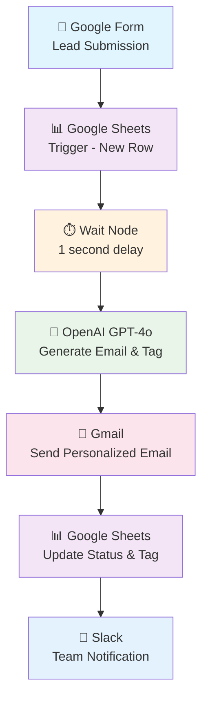
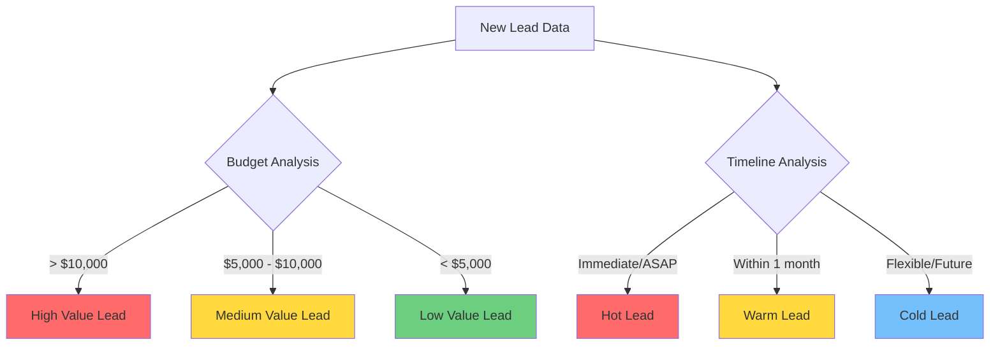

# N8N AI Lead Management Workflow

## 📋 ภาพรวมของโปรเจ็กต์

เวิร์กโฟลว์อัตโนมัติสำหรับการจัดการลูกค้าเป้าหมาย (Lead Management) โดยใช้ n8n, OpenAI, และ Google Workspace เพื่อสร้างระบบ CRM อัตโนมัติที่สมบูรณ์

## 🎯 วัตถุประสงค์

- จัดการข้อมูลลูกค้าเป้าหมายโดยอัตโนมัติ
- สร้างอีเมลส่วนบุคคลด้วย AI
- ติดแท็กและจัดประเภทลูกค้าเป้าหมายอัตโนมัติ
- แจ้งเตือนทีมงานผ่าน Slack
- อัปเดต CRM (Google Sheets) แบบเรียลไทม์

## 🔄 ขั้นตอนการทำงานของเวิร์กโฟลว์



## 🛠️ เครื่องมือที่ใช้

| เครื่องมือ | วัตถุประสงค์ | สถานะ |
|-----------|-------------|--------|
| **n8n** | Workflow Automation Platform | 🟢 Required |
| **Google Forms** | Lead Capture Form | 🟢 Required |
| **Google Sheets** | CRM Database | 🟢 Required |
| **OpenAI GPT-4o** | AI Email Generation & Lead Tagging | 🟢 Required |
| **Gmail** | Email Delivery Service | 🟢 Required |
| **Slack** | Team Notifications | 🟡 Optional |

## 📋 ขั้นตอนการติดตั้งและตั้งค่า

### 1. 🎯 Google Sheets Trigger Node
```markdown
- เชื่อมต่อกับ Google Cloud Console
- เปิดใช้งาน Google Sheets API
- สร้าง OAuth Client ID และ Secret
- ตั้งค่า Poll time: ทุกนาที
- เลือก Document และ Sheet ที่ต้องการ
```

### 2. ⏱️ Wait Node Configuration
```markdown
- หน่วงเวลา: 1 วินาที (หรือ 5-15 นาที)
- เพื่อให้การตอบกลับดูเป็นธรรมชาติ
```

### 3. 🤖 OpenAI Node Setup
```markdown
- Model: GPT-4o
- Resource: Text
- Operation: Message Model
- ต้องมี OpenAI API Key
```

#### System Prompt Template:
```
You are a lead nurturing assistant. Your job is to write an email to a new lead who just filled out the form on our website, which is an AI Consulting website. Your name is Pam and you work as a customer service rep for ABC Corp.

Here's information about the lead:
- Name: {{ $json.name }}
- Email: {{ $json.email address }}
- Services interested in: {{ $json.services interested in }}
- Budget range: {{ $json.budget range }}
- Preferred contact time: {{ $json.preferred contact time }}
- Project timeline: {{ $json.project timeline }}
- Additional comments: {{ $json.additional comments }}

Output Fields Required: subject, body, tag

Tag Categories:
- High Value Lead: งบประมาณ >$10,000, พรีเมียมเซอร์วิส
- Medium Value Lead: งบประมาณปานกลาง
- Low Value Lead: งบประมาณ <$5,000, บริการพื้นฐาน
- Hot Lead: ต้องการเร่งด่วน

Output as JSON format.
```

### 4. 📧 Gmail Node Configuration
```markdown
- Operation: Send Message
- Email Type: Text
- To: ดึงจาก Google Sheets
- Subject: ดึงจาก OpenAI output
- Message: ดึงจาก OpenAI output
- ปิด n8n attribution
```

### 5. 📊 Google Sheets Update Node
```markdown
- Operation: Update Row in Sheet
- Match on: name หรือ email
- อัปเดต columns: status, tag
- Status format: "{{name}} was contacted on {{DateTime.now}}"
```

### 6. 💬 Slack Notification Node
```markdown
- Operation: Send a Message
- Channel: เลือกช่องที่ต้องการ
- Message Type: Simple Text
- รวมข้อมูล: ชื่อ, ความสนใจ, งบประมาณ, แท็ก
```

## 🎯 Lead Tagging Strategy



## 📊 Google Sheets Structure

| Column | Type | Description |
|--------|------|-------------|
| name | Text | ชื่อลูกค้าเป้าหมาย |
| email address | Email | อีเมลติดต่อ |
| services interested in | Text | บริการที่สนใจ |
| budget range | Text | ช่วงงบประมาณ |
| preferred contact time | Text | เวลาติดต่อที่สะดวก |
| project timeline | Text | กรอบเวลาโครงการ |
| additional comments | Text | ข้อมูลเพิ่มเติม |
| status | Text | สถานะการติดต่อ |
| tag | Text | แท็กประเภทลูกค้า |

## 🚀 การทดสอบและเปิดใช้งาน

### ขั้นตอนการทดสอบ:
1. ✅ ทดสอบแต่ละ node แยกกัน
2. ✅ ทดสอบการเชื่อมต่อระหว่าง nodes
3. ✅ ทดสอบด้วยข้อมูลจริงจาก Google Form
4. ✅ ตรวจสอบการอัปเดต Google Sheets
5. ✅ ยืนยันการส่งอีเมลและการแจ้งเตือน Slack

### การเปิดใช้งาน:
```bash
1. บันทึกเวิร์กโฟลว์
2. คลิก "Make this workflow active"
3. ตรวจสอบการทำงานด้วยข้อมูลทดสอบ
```

## 🔧 การแก้ไขปัญหา

### ปัญหาที่พบบ่อย:

| ปัญหา | สาเหตุ | วิธีแก้ไข |
|-------|--------|----------|
| Google Sheets ไม่ trigger | API ไม่เปิดใช้งาน | เปิด Google Sheets API |
| OpenAI ไม่ตอบ | API Key ผิด | ตรวจสอบ API Key |
| Email ไม่ส่ง | Gmail permissions | Re-authenticate Gmail |
| Slack ไม่แจ้งเตือน | Channel ไม่ถูกต้อง | ตรวจสอบ Channel name |

## 📈 การปรับปรุงและขยายผล

### แนวทางการพัฒนาต่อ:
- 🔄 เพิ่ม Follow-up email sequences
- 📊 รายงานและ Analytics
- 🤖 Chatbot integration
- 📱 Mobile notifications
- 🔍 Lead scoring algorithms

## 📞 การติดต่อและสนับสนุน

สำหรับคำถามเกี่ยวกับเวิร์กโฟลว์นี้:
- 📧 Email: [your-email@company.com]
- 💬 Slack: [#automation-support]
- 📖 Documentation: [link-to-detailed-docs]

---

## 📄 License

This project is licensed under the MIT License - see the [LICENSE](LICENSE) file for details.

---

**สร้างโดย:** [Your Name]  
**วันที่อัปเดตล่าสุด:** September 15, 2025  
**เวอร์ชัน:** 1.0.0